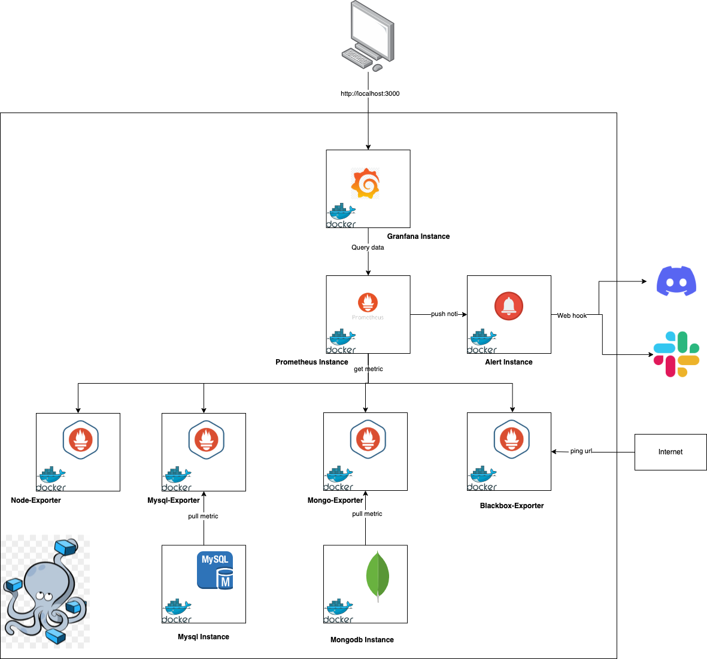

## Monitoring Stack
# Giới thiệu
Dự án này triển khai một hệ thống giám sát (monitoring) đầy đủ, bao gồm:

- Prometheus: Thu thập và lưu trữ metrics.
- Node Exporter: Cung cấp metrics về tài nguyên máy chủ (CPU, RAM, Disk,…).
- MySQL Exporter: Cung cấp metrics về MySQL (queries, buffer, connections,…).
- Mongo Exporter: Cung cấp metrics về MongoDB (opcounters, connections,…).
- Blackbox Exporter: Cung cấp cơ chế giám sát các dịch vụ, endpoint (ICMP, HTTP, DNS,…).
- Grafana: Tạo các biểu đồ (dashboard) và hiển thị metrics một cách trực quan.

# Infrastructure 


# Yêu cầu hệ thống
Docker và Docker Compose được cài đặt sẵn.
(Tùy chọn) Máy chủ hoặc môi trường ảo hóa có thể mở các cổng cần thiết (3000 cho Grafana, 9090 cho Prometheus, v.v…).

# Thiết lập dự án

1. Tạo file .env từ .env.example
Trong thư mục gốc của dự án, bạn sẽ thấy một file mẫu tên là .env.example. Hãy sao chép file này thành .env:

```bash
$ cp .env.example .env
```

Tiếp đó, mở file .env để điều chỉnh các cấu hình (nếu cần).

2. Chạy Docker Compose
Sau khi cấu hình .env xong, bạn chỉ cần chạy:

```bash
$ docker-compose up -d --build
```

Lệnh này sẽ tải các image cần thiết, khởi chạy các container:

grafana
prometheus
node-exporter
mysql-exporter
mongo-exporter
blackbox-exporter
Lưu ý: Quá trình pull image và khởi động container có thể mất một ít thời gian tùy tốc độ mạng và cấu hình máy.

3. Truy cập Grafana
Mặc định, Grafana lắng nghe (listen) trên cổng 3000.
Hãy mở trình duyệt và truy cập:
Link:[`http://localhost:3000`]
Tài khoản của Grafana đã được config trong .env

4. Tạo Dashboard trong Grafana
Sau khi đăng nhập thành công, để tạo dashboard, bạn có thể:

Tự tạo thủ công (Create > Dashboard > Add new panel).
Import Dashboard có sẵn từ Grafana.com hoặc file JSON.
Import Dashboard bằng “Dashboard ID”
Ví dụ, bạn có thể thử một số dashboard phổ biến:

Node Exporter Full: ID 1860
MySQL Exporter: ID 7362 (hoặc 6239, tùy sở thích)
MongoDB (Percona): ID 2583
Blackbox Exporter: ID 7587 (hoặc dashboard khác phù hợp)

### Cách import:

Chọn Create (dấu +) > Import.
Nhập “Dashboard ID” (VD: 1860), rồi nhấn “Load”.
Ở phần Options, chọn data source phù hợp (thông thường là “Prometheus”).
Bấm Import để hoàn tất.
Dashboard sau đó sẽ xuất hiện trong danh sách Dashboard của Grafana.

Cấu trúc thư mục (ví dụ)

├── docker-compose.yml
├── .env.example
├── .env (sau khi copy từ .env.example)
├── README.md
└── ...
Gỡ lỗi và xử lý sự cố
Grafana: Nếu không truy cập được localhost:3000, có thể cổng 3000 bị bận hoặc firewall chặn. Kiểm tra bằng docker ps xem container Grafana đã chạy chưa.
Prometheus: Nếu localhost:9090 không hoạt động, kiểm tra logs của container Prometheus (docker logs prometheus).
Exporter: Luôn kiểm tra logs khi có bất kỳ exporter nào không “UP”.

### Kết luận
Với các bước trên, bạn đã sở hữu một hệ thống monitoring cơ bản. Tùy vào nhu cầu, bạn có thể mở rộng thêm exporter khác, hoặc thêm nhiều dashboard chi tiết hơn trong Grafana.

Chúc bạn thành công!

### Tham khảo
Grafana Official Docs
Prometheus Official Docs
Node Exporter
MySQL Exporter
MongoDB Exporter
Blackbox Exporter