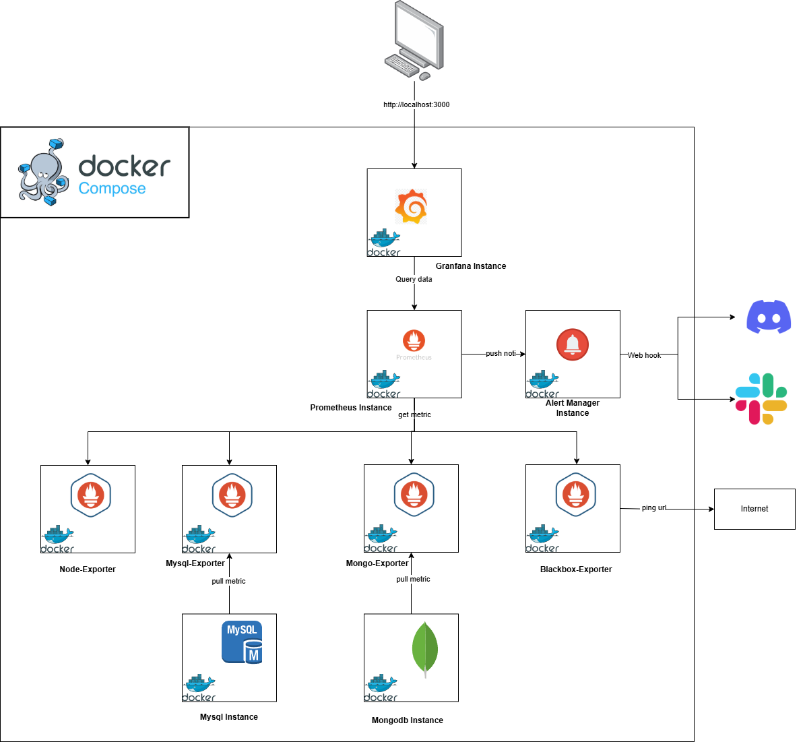

# Monitoring Stack

# Table of Contents

1. [Introduction](#introduction)  
2. [Infrastructure Overview](#infrastructure-overview)  
3. [System Requirements](#system-requirements)  
4. [Setup Instructions](#setup-instructions)  
   - [Create .env File](#1-create-env-file)
   - [Run Docker Compose](#2-run-docker-compose)
   - [Access Grafana](#3-access-grafana)
   - [Create Dashboards](#4-create-dashboards)
   - [Configure Notifications](#5-configure-notifications)
5. [Troubleshooting](#troubleshooting)  
6. [Production Deployment](#production-deployment)  
7. [Conclusion](#conclusion)  
8. [References](#references) 

## Introduction

This project implements a comprehensive monitoring system including tools for metrics collection, visualization, and alerting. The stack comprises:

- Prometheus: Collects and stores metrics.
- Node Exporter: Provides metrics about server resources (CPU, RAM, Disk, etc.).
- MySQL Exporter: Provides metrics about MySQL (queries, buffer, connections, etc.).
- Mongo Exporter: Provides metrics about MongoDB (opcounters, connections, etc.).
- Blackbox Exporter: Provides mechanisms to monitor services and endpoints (ICMP, HTTP, DNS, etc.).
- Grafana: Creates dashboards and visualizes metrics intuitively.

## Infrastructure Overview

The monitoring stack utilizes Docker containers to simplify deployment. The overall architecture is as follows:


# Requirements
1. Prerequisites:

Installed Docker and Docker Compose.
Ports open for required services:
3000 for Grafana
9090 for Prometheus
(Configurable via .env)

2. Optional:

A server or virtualization environment that supports exposing these ports.
SSL and firewall configurations for production security.

## Setup Instructions

1. Create .env File

In the project's root directory, you will find a sample file named .env.example. Copy this file and rename it to .env:
```bash
$ cp .env.example .env
```
Then, open the .env file to adjust configurations (if necessary).

2. Run Docker Compose

After configuring .env, simply execute:
```bash
$ docker-compose up -d --build
```
This command will pull the necessary images and start the containers:

- grafana.
- prometheus.
- node-exporter.
- mysql-exporter.
- mongo-exporter.
- blackbox-exporter.

Note: The process of pulling images and starting containers may take some time, depending on your network speed and machine configuration.

3. Access Grafana

- By default, Grafana listens on port 3000.
- Open your browser and navigate to: [http://localhost:3000].
- The Grafana account credentials are configured in the .env file.

4. Create Dashboards in Grafana

- After successfully logging in, to create dashboards, you can:

a, Manually create dashboards 

- On the Grafana interface: (Create > Dashboard > Add new panel).
- Then configure the dashboards manually based on the list of metrics.

b, Import from a template file  

- Import pre-existing dashboards from JSON files (e.g., the Mongo dashboard in /granfana_conf/dashboards/mongo-dashboard.json).

c,  Use the open-source community

- For example, you can try popular dashboards from the Grafana community by importing dashboards using their "Dashboard ID":

+, Node Exporter Full: ID 1860

+, MySQL Exporter: ID 7362 (or 6239, depending on your preference)

+, MongoDB (Percona): ID 2583

+, Blackbox Exporter: ID 7587 (or other suitable dashboards)

5. Configure Notifications

a, Using  Alert Manager

- Define alert rules in Prometheus (/prometheus_conf/prometheus.yml).
- Configure Alert Manager with routing rules (/alertmanager_conf/alert-manager.yml).
- Alerts can be viewed in Grafana under Alerting > Alert rules.

b, Using Grafana without Alert Manager

- Set up notification channels via Configuration > Notification Channels.
- Define alerts directly on Grafana panels in your dashboards.
- Supported channels include:

+, Email

+, Slack

+, Webhook

+, Microsoft Teams, and more.

## Debugging and Troubleshooting

- If you see a Ports are not available error, it means a process on your local machine is already using a port that the system needs. The solution is to check which instance in the Docker Compose file is using that port and change the exposed port to avoid conflicts.
- Grafana: If you cannot access localhost:3000, the port may be occupied, or the firewall may be blocking it. Check if the Grafana container is running using docker ps.
- Prometheus: If localhost:9090 is not working, check the Prometheus container logs (docker logs prometheus).
- Exporter: Always check logs if any exporter is not “UP.”

## Production Deployment

For production, ensure secure communication between Prometheus and exporters, especially when dealing with multiple servers:

1. Security Mechanisms:

- Reverse Proxy with Authentication
- SSL Encryption
- Firewalls
- Virtual Private Cloud (VPC)

2. Exporter Deployment:

- Deploy exporters on individual servers.
- Use private networking or secure public API access

## Conclusion

With this guide, you’ve set up a basic monitoring system. Depending on your requirements, you can:

- Add more exporters for extended monitoring.
- Create detailed and customized Grafana dashboards.
This stack offers a scalable and modular solution to meet diverse monitoring needs.

## References

- [Grafana Official Docs](https://grafana.com/docs/grafana/latest/).
- [Prometheus Official Docs](https://prometheus.io/docs/prometheus/latest/getting_started/).
- [Node Exporter](https://github.com/prometheus/node_exporter).
- [MySQL Exporter](https://github.com/prometheus/mysqld_exporter).
- [MongoDB Exporter](https://github.com/percona/mongodb_exporter).
- [Blackbox Exporter](https://github.com/prometheus/blackbox_exporter).
- [Alert Manager](https://github.com/prometheus/alertmanager).